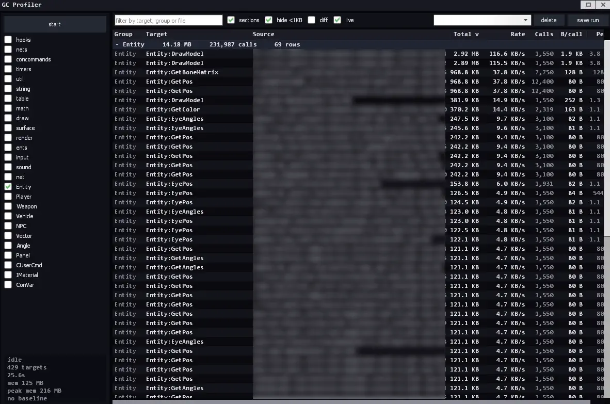
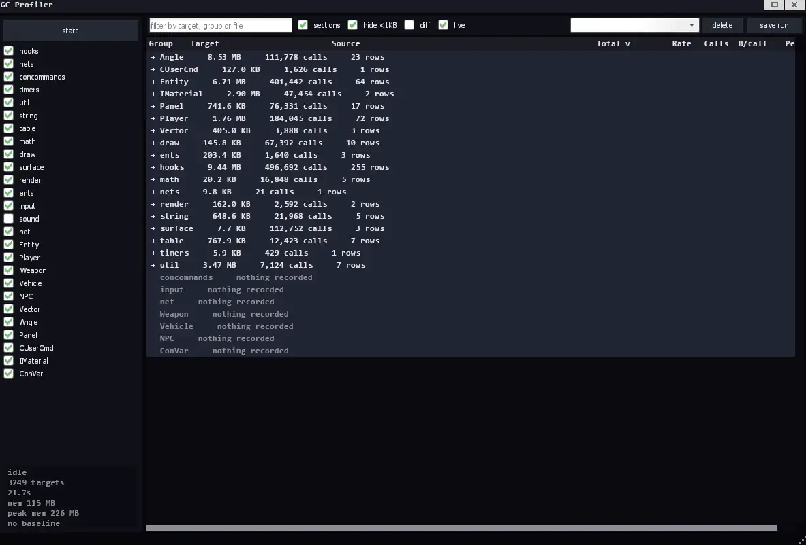

# GC Profiler

A client-side Lua allocation profiler for Garry's Mod.

It answers one question: **which code on this client is producing the most garbage?** Not which code is slow - which code allocates. Those are different problems, and GMod has plenty of tools for the first and almost none for the second.

You point it at hooks, net receivers, timers, console commands, metatable methods, or any table of functions, record for a while, and get a sortable table of how many kilobytes each one produced, how often it was called, and how much it cost per call. Runs can be saved and compared against each other, so you can prove a fix actually worked instead of guessing.

Single file, no dependencies, no globals, admin gated.




---

## Install

```
addons/gcprof/lua/autorun/gcprofiler.lua
```

That's it. It's a client-side autorun file.

---

## Quick start

1. Open the console and run `gcprof` (bind it - `bind p gcprof` - youll be opening and closing it a lot).
2. On the left, tick which sources you want to record. `hooks`, `nets`, `concommands` and `timers` are on by default and are a good starting point.
3. Hit **start**.
4. Close the window and play normally for 30–60 seconds. The window captures your mouse and keyboard, so you can't move while it's open. Recording continues while it's closed.
5. Reopen with `gcprof`, hit **stop**, and read the table.

Sort by **Total** to find whats producing the most garbage overall. Sort by **B/call** to find code that's wasteful every single time it runs, even if it doesn't run often. Sort by **Peak** to find spiky allocators that occasionally dump a lot at once.

---

## The window

### Sources panel (left)

Every tickable thing the profiler knows how to wrap. Tick before you start; changes mid-run don't apply until the next recording.

| Source | What it wraps | Default |
|---|---|---|
| `hooks` | every entry in `hook.GetTable()` | on |
| `nets` | every `net.Receive` handler | on |
| `concommands` | every registered console command | on |
| `timers` | `timer.Create` / `timer.Simple` callbacks | on |
| `util` `string` `table` `math` `draw` `surface` `render` `ents` `input` `sound` `net` | every function in that library | off |
| `Entity` `Player` `Weapon` `Vehicle` `NPC` `Vector` `Angle` `Panel` `CUserCmd` `IMaterial` `ConVar` | every method on that metatable | off |

The default-off ones are **call-site attributed** - see [Two kinds of attribution](#two-kinds-of-attribution) below. They're powerful and they're heavy. Read that section before turning `string` or `Entity` on.

### Status readout (bottom left)

```
recording              state
2117 targets           how many things are wrapped, plus dropped samples if any
12.5s                  length of this run
mem 168 MB             current Lua heap
peak 402 MB            highest heap seen during normal play
base: myrun (30s)      loaded comparison run and its length
```

`peak` is an always-on high water mark for normal gameplay. While a recording is running it switches to `run peak`, which is the peak for that run - during a recording the collector is deferred, so that number reflects the profilers own behaviour, not the game's.

### Toolbar

- **filter** - matches against target name, group and source file. Live, per keystroke.
- **sections** - group rows by source, with a subtotal bar per section. Click a bar to fold it, right click any bar to fold or unfold every section at once.
- **hide <1KB** - drop anything that barely moved. In diff mode this filters on the *change*, which is exactly what you want.
- **diff** - replace every number with its change since the loaded baseline. Needs a baseline.
- **live** - rebuild the table twice a second while recording. Off by default because rebuilding allocates, and during a run the collector is deferred.
- **compare with…** - load a saved run as the baseline.
- **delete** - delete the selected saved run.
- **save run** - write the current results to `data/gcprof/<name>.json`.

### Table

| Column | Meaning |
|---|---|
| Group | which source this came from |
| Target | the hook name and id, the net message, the method, etc. |
| Source | file and line. Long paths are anchored to the right so you always see the filename and line. |
| Total | kilobytes allocated over the whole run |
| Rate | kilobytes per second. **This is the one to compare across runs of different lengths.** |
| Calls | how many times it ran |
| B/call | average bytes per call |
| Peak | worst single call |

Controls:

- **click a header** - sort. Click again to reverse.
- **drag the line between two headers** - resize that column. Drag it to nothing to collapse it.
- **double click a header** - reset all column widths.
- **shift + mouse wheel** - scroll sideways when the columns are wider than the window.
- **right click a row** - copy its target and source file to the clipboard.

Window position, size, maximised state and column widths are saved to `data/gcprof/ui.json` and restored next time.

---

## Comparing runs

Save a run before your change, make the change, record again, load the old run as the baseline, tick **diff**.

Every column becomes a delta. Red is worse, green is better. Rows that existed in the baseline but produced nothing this time appear with `(gone)` and all-negative numbers, so a hook you actually fixed shows up as a big green line instead of silently vanishing from the table.

**Rate, B/call and Peak are the honest comparisons.** They don't care how long a run lasted. Total and Calls naturally grow with run length, so a 90-second run will look "worse" than a 30-second one on those two columns even if nothing changed. The status panel shows both durations so you can tell when that matters.

Rows are matched between runs on **group + target + source file:line**. If you edit a file and the line numbers shift, call-site attributed entries from before the edit won't line up with the ones after. Whole-function entries (hooks, nets) match on the function's definition line, so they're more stable but not immune.

---

## Console commands

All four require admin.

| Command | Effect |
|---|---|
| `gcprof` | toggle the window |
| `gcprof_start` | start recording without opening the window |
| `gcprof_stop [n]` | stop and print the top `n` results to console (default 30) |
| `gcprof_save [name]` | save the current results; defaults to a timestamp |

### ConVars

| ConVar | Default | Effect |
|---|---|---|
| `gcprof_gc_at` | 128 | MB of heap growth before the collector is allowed to catch up |
| `gcprof_limit` | 1024 | MB of growth at which the profiler gives up and stops itself |

Raise `gcprof_gc_at` for slightly cleaner measurements at the cost of more memory. Raise `gcprof_limit` if you're profiling something that legitimately retains a lot and keep getting auto-stopped. Lower both if you're on a machine with little headroom.

---

## How it works

Each wrapped function gets replaced with a closure that reads `collectgarbage("count")` before and after the real call. The difference is how much Lua memory that call produced.

Nested wrapped calls are subtracted from their parents, so if hook A calls hook B, B's allocations don't get billed to A. That's what makes the numbers add up instead of double counting all the way up the stack.

**The collector is stopped during a recording.** This is load-bearing: if a collection ran in the middle of a measurement window, memory would go *down* mid-measurement and the delta would be garbage. The trade-off is that memory climbs with nothing reclaiming it.

To stop that from ending in an out-of-memory crash, the profiler adds a single `Think` hook while recording. That hook is the one place in the frame where no measurement window is open, so it's safe to let the collector work there. Past `gcprof_gc_at` MB of growth it runs a bounded number of incremental GC steps and then re-stops the collector. So its not "no GC" - it's deferred GC, once per frame, at a point that can't corrupt a measurement.

As a backstop, if a delta ever comes back negative a collection got in anyway. That sample is dropped rather than recorded wrong, and the count appears in the status panel. If you see drops climbing, treat the surrounding numbers with suspicion.

### Two kinds of attribution

**Whole-function** (hooks, nets, timers, concommands). One row per function. The row tells you *this hook allocated 3.4 MB*. Cheap - two counter reads per call.

**Call-site** (libraries, metatables). One row per *place that called it*. The row tells you *`Entity:GetPos` allocated 40 MB, and 38 of those came from `cl_hud.lua:412`*. This is the only way to find out who's hammering a shared function, and it's the whole reason those sources exist.

It costs a `debug.getinfo` on every single call, which allocates a table and is slow. Turning on `string` or `Entity` will visibly tank your framerate and will hit the heap limit much faster. **Use them in ten second bursts with a filter in mind, not for general recording.**

The getinfo overhead is measured and excluded from the reported numbers, so call-site figures are accurate even though the profiler is working hard to produce them. What it costs you is time and heap headroom, not accuracy.

---

## Limitations

Read these before you trust a number.

**Timers that were already running are invisible.** The `timers` source works by intercepting `timer.Create` and `timer.Simple` as they're called, so it only sees timers created *after* you hit start. A repeating timer that was set up when the map loaded will never appear. If you suspect a timer, restart the recording and trigger whatever creates it.

**Hooks are snapshotted at start.** Anything added with `hook.Add` after you hit start isn't wrapped, and won't appear. Same for net receivers registered after start - although those *are* caught, because `net.Receive` is intercepted the same way timers are.

**Only Lua memory is visible.** `collectgarbage("count")` reports the Lua heap. Textures, models, sounds, engine-side allocations and anything a binary module does are invisible. A client can be eating memory in ways this tool will never show you.

**It measures garbage produced, not memory retained.** A function that allocates 50 MB of short-lived tables and a function that allocates 50 MB it holds onto forever look identical here. The first is a GC pressure problem, the second is a leak. This tool finds the first.

**Frame pacing during a recording isn't representative.** The collector is deferred and every wrapped call pays overhead, so don't judge FPS while recording. Measure allocations here, measure frame time with something else.

**Errors inside a wrapped function skip its accounting.** If a hook errors, the profiler's bookkeeping for that call never runs. The nesting counter is reset every frame so the damage can't spread, but that call is lost.

**Sources that never fired show as "nothing recorded".** With sections on, a source you ticked that produced no rows still gets a bar. That means it was recording and nothing happened - not that you forgot to tick it.

**Wrapping is intrusive.** Every enabled source replaces real functions with closures for the duration of the run and restores them on stop. Restoration checks that the function is still the profiler's own before putting the original back, so it wont resurrect something another addon removed mid-run. Still: don't leave a recording running on a live client for hours.

**The Source column assumes a monospace font.** Long paths are shifted left to keep the tail visible, using character count rather than measured width. If Consolas isn't available (some Linux clients) the alignment drifts a few pixels. Nothing overflows, it just looks slightly off.

**`_G` is not wrapped, deliberately.** Wrapping globals like `pcall`, `pairs` or `setmetatable` breaks things in exciting ways. If you need a specific global measured, wrap the table it lives in.

---

## Permissions

Every console command checks `LocalPlayer():IsAdmin()` and does nothing otherwise. That's the entire permission model - no CAMI, no usergroup config, no ULX or serverguard integration, no server-side component at all.

**This is deliberately lightweight, and it is not a security boundary.** Being clear about that matters more than the feature:

- The profiler runs entirely in the player's own Lua state.
- It only ever reads their own client's memory. It sends nothing, reads nothing from other players, and touches the server not at all.
- Anyone determined to bypass the check doesnt need to - they can just run their own copy of the code and get exactly what they already had.

So the gate's real job is keeping a developer tool out of normal players' hands, and stopping someone from accidentally halting their own garbage collector. It does that well. It won't stop anyone who actually wants in, and no client-side check ever could.

If you want it wired into CAMI or your admin mod, replace the `allowed()` function at the bottom of the file. It's four lines and it's the only place permissions are checked.

---

## Extending it

There are no globals, so other addons cant register sources. Adding your own is a one line edit next to the built-in sources:

```lua
-- whole-function attribution: one row per function in the table
addTable("myaddon", MyAddon, "MyAddon.", false, false)

-- call-site attribution: one row per place that called each function
addTable("myaddon", MyAddon, "MyAddon.", true, false)

-- any metatable
addMeta("MyCustomMeta", false)
```

`addTable(name, tbl, prefix, callSite, onByDefault)` - `prefix` is cosmetic, it's what gets put in front of the function name in the Target column. `addMeta(metaName, onByDefault)` is always call-site attributed.

For anything more custom, `addSource(name, description, attachFn, onByDefault)` takes a function that runs when recording starts. Inside it, call `wrapTable` or `wrap` on whatever you like and register an undo with `onStop`.

---

## Performance when idle

With no recording running and the window closed, the only thing this addon executes is a timer tick four times a second that reads a counter and compares it. No hooks are registered - the `Think` guard is added on start and removed on stop. No wrappers exist. Nothing is patched.

While the window is open there's the usual VGUI paint cost. The table is drawn manually rather than through `DListView`, one pass per column, with every display string baked at refresh time so the paint loop itself doesn't allocate. A few thousand rows scroll smoothly.

---

## Files

| Path | What |
|---|---|
| `data/gcprof/<name>.json` | a saved run |
| `data/gcprof/ui.json` | window rect and column widths |

Saved runs are plain JSON arrays of `[group, target, source, kb, calls, peak]` - easy enough to diff or graph outside the game if you want to.
